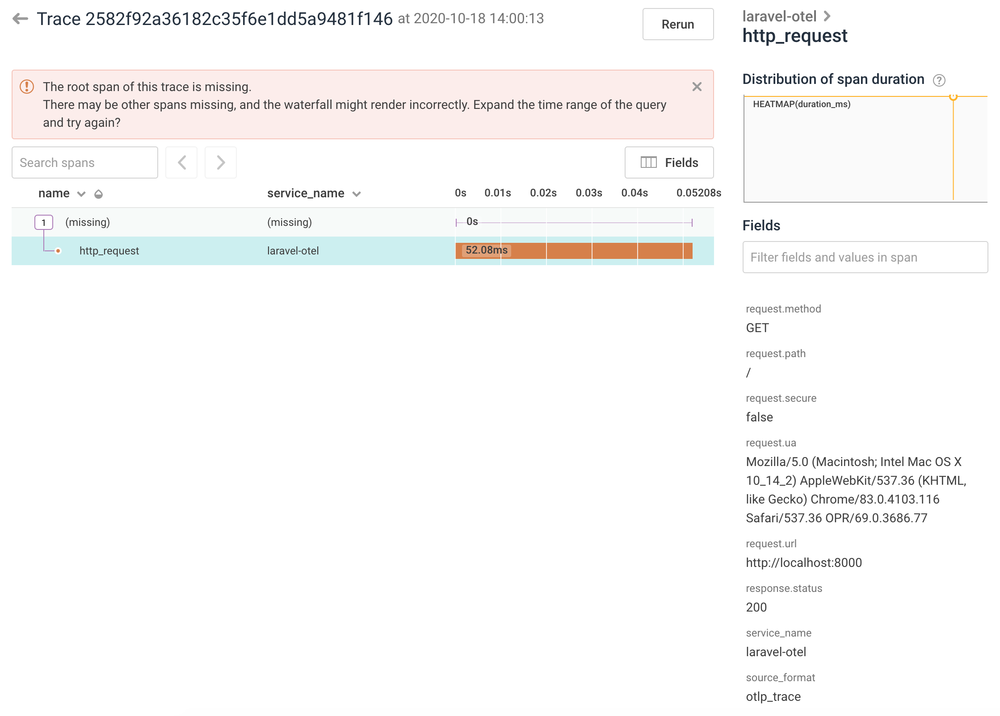

# Exporting to Honeycomb.io

Note: OpenTelemetry is currently alpha/pre-release

In this example we'll start the [OpenTelemetry Collector](https://github.com/open-telemetry/opentelemetry-collector) which is configured to send traces to Honeycomb.io. Take a peek in `otel-config.yaml` to see how things are configured.

### Assumptions
* You have integrated laravel-opentelelemtry into your application

## High Level view

Your Laravel App -> OpenTelemetry PHP SDK -> Zipkin Protocol -> OpenTelemetry Collector -> OTel Honeycomb.io Exporter -> Honeycomb.io


## Starting the OpenTelemetry Collector

*Optional*: Set our Honeycomb.io writekey. The Honeycomb exporter is set to debug mode so you'll still see what _would_ be sent to Honeycomb, if the key isn't set.

```
export HONEYCOMB_WRITEKEY=xxxxxxxx
export HONEYCOMB_DATASET=my-dataset # (Default: laravel-opentelemetry)
```

### Start

```
docker-compose up
```

## What you should see


### OpenTelemetry Collector starting up
```
$ docker-compose up
Starting examples_opentelemetry_1 ... done
Attaching to examples_opentelemetry_1
opentelemetry_1  | {"level":"info","ts":1603025777.5841062,"caller":"service/service.go:396","msg":"Starting OpenTelemetry Contrib Collector...","Version":"latest","GitHash":"85ad20ca","NumCPU":2}
opentelemetry_1  | {"level":"info","ts":1603025777.5846372,"caller":"service/service.go:240","msg":"Setting up own telemetry..."}
opentelemetry_1  | {"level":"info","ts":1603025777.5912657,"caller":"service/telemetry.go:110","msg":"Serving Prometheus metrics","address":":8888","legacy_metrics":false,"new_metrics":true,"level":0,"service.instance.id":"ca7f5687-920b-4f7a-8bff-60e3d7d80296"}
opentelemetry_1  | {"level":"info","ts":1603025777.5929065,"caller":"service/service.go:277","msg":"Loading configuration..."}
opentelemetry_1  | {"level":"info","ts":1603025777.6237845,"caller":"service/service.go:288","msg":"Applying configuration..."}
opentelemetry_1  | {"level":"info","ts":1603025777.6240692,"caller":"service/service.go:309","msg":"Starting extensions..."}
opentelemetry_1  | 2020/10/18 12:56:17 libhoney - DEBUG - default transmission starting
opentelemetry_1  | {"level":"info","ts":1603025777.6322484,"caller":"builder/exporters_builder.go:308","msg":"Exporter is enabled.","component_kind":"exporter","exporter":"honeycomb"}
opentelemetry_1  | {"level":"info","ts":1603025777.6331253,"caller":"builder/exporters_builder.go:308","msg":"Exporter is enabled.","component_kind":"exporter","exporter":"logging"}
opentelemetry_1  | {"level":"info","ts":1603025777.6331763,"caller":"service/service.go:324","msg":"Starting exporters..."}
opentelemetry_1  | {"level":"info","ts":1603025777.633215,"caller":"builder/exporters_builder.go:90","msg":"Exporter is starting...","component_kind":"exporter","component_type":"honeycomb","component_name":"honeycomb"}
opentelemetry_1  | {"level":"info","ts":1603025777.6334221,"caller":"builder/exporters_builder.go:95","msg":"Exporter started.","component_kind":"exporter","component_type":"honeycomb","component_name":"honeycomb"}
opentelemetry_1  | {"level":"info","ts":1603025777.6336055,"caller":"builder/exporters_builder.go:90","msg":"Exporter is starting...","component_kind":"exporter","component_type":"logging","component_name":"logging"}
opentelemetry_1  | {"level":"info","ts":1603025777.6336443,"caller":"builder/exporters_builder.go:95","msg":"Exporter started.","component_kind":"exporter","component_type":"logging","component_name":"logging"}
opentelemetry_1  | {"level":"info","ts":1603025777.6336994,"caller":"builder/pipelines_builder.go:207","msg":"Pipeline is enabled.","pipeline_name":"traces","pipeline_datatype":"traces"}
opentelemetry_1  | {"level":"info","ts":1603025777.6337452,"caller":"service/service.go:337","msg":"Starting processors..."}
opentelemetry_1  | {"level":"info","ts":1603025777.633861,"caller":"builder/pipelines_builder.go:51","msg":"Pipeline is starting...","pipeline_name":"traces","pipeline_datatype":"traces"}
opentelemetry_1  | {"level":"info","ts":1603025777.6339595,"caller":"builder/pipelines_builder.go:61","msg":"Pipeline is started.","pipeline_name":"traces","pipeline_datatype":"traces"}
opentelemetry_1  | {"level":"info","ts":1603025777.6340969,"caller":"builder/receivers_builder.go:235","msg":"Receiver is enabled.","component_kind":"receiver","component_type":"zipkin","component_name":"zipkin","datatype":"traces"}
opentelemetry_1  | {"level":"info","ts":1603025777.634148,"caller":"service/service.go:349","msg":"Starting receivers..."}
opentelemetry_1  | {"level":"info","ts":1603025777.6341856,"caller":"builder/receivers_builder.go:70","msg":"Receiver is starting...","component_kind":"receiver","component_type":"zipkin","component_name":"zipkin"}
opentelemetry_1  | {"level":"info","ts":1603025777.634401,"caller":"builder/receivers_builder.go:75","msg":"Receiver started.","component_kind":"receiver","component_type":"zipkin","component_name":"zipkin"}
opentelemetry_1  | {"level":"info","ts":1603025777.6345055,"caller":"service/service.go:252","msg":"Everything is ready. Begin running and processing data."}
```

### Debug log: Honeycomb Exporter

You can see here the debug line from sending our trace as an event to Honeycomb

```
opentelemetry_1  | 2020/10/18 13:00:13 libhoney - DEBUG - adding event to transmission; queue length 0
opentelemetry_1  | 2020/10/18 13:00:13 libhoney - DEBUG - Send enqueued event: &{WriteKey:REDACTED Dataset:laravel-opentelemetry SampleRate:1 APIHost:https://api.honeycomb.io Timestamp:2020-10-18 13:00:13.331373 +0000 UTC Metadata:<nil> fieldHolder:{data:map[child_span_count:<nil> duration_ms:52.079 has_remote_parent:true name:http_request op.status_code:Ok op.status_description:Not an error; returned on success. request.ip:127.0.0.1 request.method:GET request.path:/ request.secure:false request.ua:Mozilla/5.0 (Macintosh; Intel Mac OS X 10_14_2) AppleWebKit/537.36 (KHTML, like Gecko) Chrome/83.0.4103.116 Safari/537.36 OPR/69.0.3686.77 request.url:http://localhost:8000 response.status:200 service_name:laravel-otel source_format:otlp_trace span_kind:span_kind_unspecified status.code:0 status.message:OK trace.parent_id:1cd1b2d9394d319f trace.span_id:242523725e56f840 trace.trace_id:2582f92a36182c35f6e1dd5a9481f146] lock:{w:{state:0 sema:0} writerSem:0 readerSem:0 readerCount:0 readerWait:0}} client:0xc000864eb0 sent:true sendLock:{state:0 sema:0}}
```

### Debug log: Logging Exporter

```
opentelemetry_1  | 2020-10-18T13:00:13.427Z	INFO	loggingexporter/logging_exporter.go:296	TraceExporter	{"#spans": 1}
opentelemetry_1  | 2020-10-18T13:00:13.427Z	DEBUG	loggingexporter/logging_exporter.go:353	ResourceSpans #0
opentelemetry_1  | Resource labels:
opentelemetry_1  |      -> service.name: STRING(laravel-otel)
opentelemetry_1  | InstrumentationLibrarySpans #0
opentelemetry_1  | Span #0
opentelemetry_1  |     Trace ID       : 2582f92a36182c35f6e1dd5a9481f146
opentelemetry_1  |     Parent ID      : 1cd1b2d9394d319f
opentelemetry_1  |     ID             : 242523725e56f840
opentelemetry_1  |     Name           : http_request
opentelemetry_1  |     Kind           : SPAN_KIND_UNSPECIFIED
opentelemetry_1  |     Start time     : 2020-10-18 13:00:13.331373 +0000 UTC
opentelemetry_1  |     End time       : 2020-10-18 13:00:13.383452 +0000 UTC
opentelemetry_1  | Attributes:
opentelemetry_1  |      -> request.method: STRING(GET)
opentelemetry_1  |      -> request.secure: STRING(false)
opentelemetry_1  |      -> op.status_code: STRING(Ok)
opentelemetry_1  |      -> request.path: STRING(/)
opentelemetry_1  |      -> op.status_description: STRING(Not an error; returned on success.)
opentelemetry_1  |      -> request.ua: STRING(Mozilla/5.0 (Macintosh; Intel Mac OS X 10_14_2) AppleWebKit/537.36 (KHTML, like Gecko) Chrome/83.0.4103.116 Safari/537.36 OPR/69.0.3686.77)
opentelemetry_1  |      -> request.ip: STRING(127.0.0.1)
opentelemetry_1  |      -> response.status: STRING(200)
opentelemetry_1  |      -> request.url: STRING(http://localhost:8000)
```

### Honeycomb.io Trace

Screenshot of the above trace as viewed in Honeycomb's trace view


